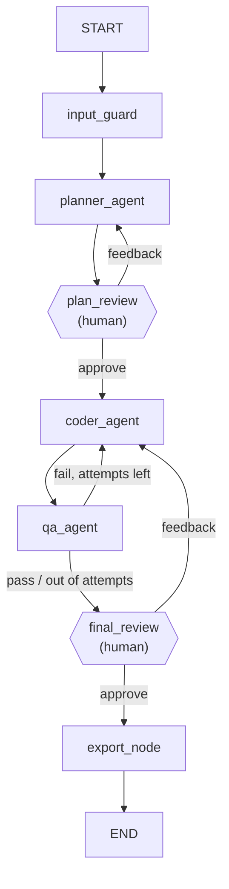

# Multi-Agent Website Builder

Course project for **AI Agents and Workflows**. A multi-agent system, built with
**LangGraph** (orchestration) and **LangChain** (tool wrapping) on **OpenAI**
models, that takes one plain-text website request and produces a single
self-contained `.html` file — with a human approving the plan and the finished
site along the way.

## What's in this ZIP

- `website_builder_agent.ipynb` — the entire project, one notebook, runs
  top-to-bottom in Google Colab.
- `README.md` — this file.

## Requirements

- Google Colab (no local setup needed).
- An OpenAI API key, added as a **Colab Secret** named `OPENAI_API_KEY` (key
  icon in the left sidebar) — never hardcoded, never printed in the notebook.
- Everything else installs itself from the notebook's first cell (`langgraph`,
  `langchain-core`, `langchain-openai`, `langchain-community`,
  `duckduckgo-search`).

## How to run it

1. Open the notebook in Colab, add the `OPENAI_API_KEY` secret.
2. Run all cells top to bottom — 5 test cases run automatically (their human
   responses are pre-scripted, no typing needed).
3. To try your own request, run in a new cell:
   ```python
   execute_workflow("a landing page for a plant shop called Green Leaf, minimal style")
   ```
   It will print the plan, wait for `APPROVE` or feedback, then do the same for
   the finished site.

## How it works



- **3 agents**, each its own LangGraph node and system prompt: `planner_agent`
  (writes the build spec), `coder_agent` (writes the HTML/CSS/JS),
  `qa_agent` (checks it and can send it back for another pass).
- **3 tools**: `validate_html` (deterministic structural check),
  `export_single_file` (writes the final site to disk), and
  `search_web_for_design_tips` (a live web search `planner_agent` uses for
  inspiration).
- **Two mandatory human checkpoints** — `plan_review` and `final_review` — are
  the *only* way into the next stage; no path in the graph can skip them, no
  matter how many revision loops happen first.
- **Memory**: `MemorySaver`, keyed by a `thread_id`, is what lets the graph
  pause on a checkpoint and resume later exactly where it stopped.
- **One core function**, `execute_workflow(user_request)`, does everything:
  starts the graph, prints each interrupt, reads the human's response, resumes.

## A couple of things worth knowing

- Every run exports its **own** `.html` file, named after its `thread_id`
  (`generated_website_<id>.html`), so test runs never overwrite each other.
- `input_guard` (a keyword/prompt-injection screen before `planner_agent`) and
  `search_web_for_design_tips` are intentionally **demo-grade** — illustrative
  of where such things plug into the graph, not production security or search.
- The coder/QA loop depends on live LLM output, so exactly how many revision
  passes it takes can vary between runs; `MAX_QA_ITERATIONS` keeps it bounded.
